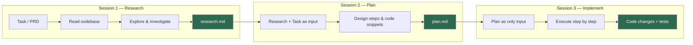

# Notes

## Core Takeaway: Research-Plan-Implement as Context Pipeline

The three-phase workflow exists because static context (CLAUDE.md, onboarding docs, progressive disclosure) does not scale for larger codebases. The more documentation you maintain alongside code, the faster it drifts from reality. Stale docs become lies the agent trusts.

The fix: extract truth on demand, directly from the code, for each task.

### The Three Phases

1. **Research** — Given a task or request, investigate the actual codebase. Produce a `research.md` that captures how the relevant parts of the system work right now. This is compressed truth, not documentation — it sits next to the code it describes and is disposable after use.

2. **Plan** — In a new context window, combine the research with the original request (PRD, bug ticket, feature spec). Produce a `plan.md` with concrete steps, file references, and code snippets. This compresses intent.

3. **Implement** — In another new context window, execute the plan. The agent starts clean with only the plan as context — no accumulated noise from research or exploration.

Each phase starts a fresh context window. Each output compresses the previous phase.

### Why Progressive Disclosure Breaks Down

Progressive disclosure (layered CLAUDE.md files at each directory level) works for smaller projects. For larger codebases it fails because:

- Documentation grows proportionally with codebase size, consuming context budget
- Nobody consistently updates docs when code changes — introducing lies
- The agent reads stale descriptions and makes wrong assumptions

On-demand research solves this: every task starts by reading the actual code, not cached descriptions of what the code used to do.

### Visual: The RPI Context Pipeline



```
SESSION 1 — Research          SESSION 2 — Plan            SESSION 3 — Implement
┌─────────────────────┐      ┌─────────────────────┐      ┌─────────────────────┐
│                     │      │                     │      │                     │
│  Task/PRD           │      │  research.md        │      │  plan.md            │
│    ↓                │      │  + Task/PRD         │      │    ↓                │
│  Read codebase      │      │    ↓                │      │  Execute steps      │
│    ↓                │      │  Design steps       │      │    ↓                │
│  Explore & verify   │      │  + code snippets    │      │  Code changes       │
│    ↓                │      │    ↓                │      │  + tests            │
│  ┌───────────────┐  │      │  ┌───────────────┐  │      │                     │
│  │ research.md   │──┼──────┼─→│  plan.md      │──┼──────┼─→                   │
│  │ (truth)       │  │      │  │ (intent)      │  │      │                     │
│  └───────────────┘  │      │  └───────────────┘  │      │                     │
└─────────────────────┘      └─────────────────────┘      └─────────────────────┘
   Compresses: codebase         Compresses: research         Consumes: plan only
   into relevant facts          into actionable steps        Clean context, no noise
```
